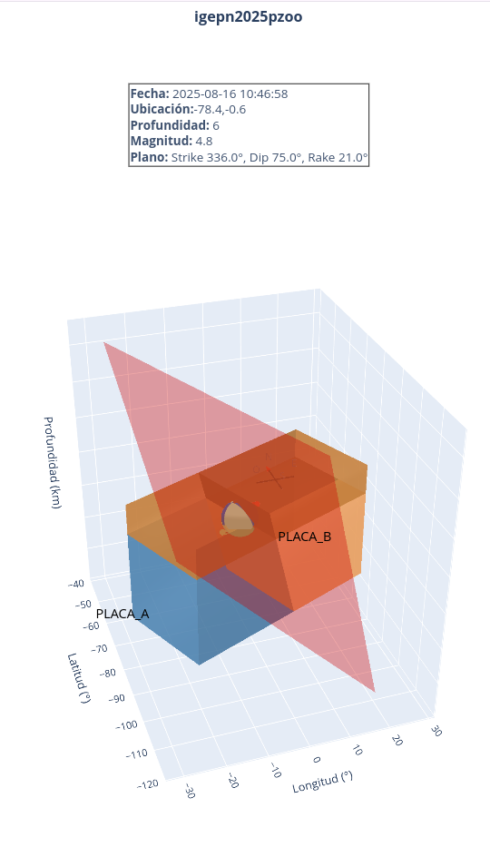

# igballs

Visualize fault geometry and slip motion using Plotly. The scripts in this repository generate an interactive 3D view of an earthquake model.

## Requirements

- Python 3
- [Plotly](https://pypi.org/project/plotly/)
- [NumPy](https://pypi.org/project/numpy/)
- [Pandas](https://pandas.pydata.org/)

Install the packages with:

```bash
pip install plotly numpy pandas
```

Using conda env
```bash
conda create -n igballs plotly numpy pandas
```
## Running

The main entry point is `igballs.py`.  
It expects a configuration file with the fault parameters and a JSON file with events information. A minimal example is shown below:

```ini
[FAULT]
;plane_1 or plane_2
plane = plane_1

[CUBE]
width = 10
height = 5

[BALL]
radius = 4.5
resolution = 222
invert_colors = False 


[ANIMATION]
steps = 25
speed = 0.33
eye_dict = {"x":-1,"y":-3,"z":2}
output_html = moving_rumis.html
move_block = east

```

```json
{
    "title": "M 7.8 - Terremoto de Pedernales, Manabí - Ecuador (2016)",
    "datetime": "2016-04-16 23:58:36",
    "latitude": 0.382,
    "longitude": -79.922,
    "depth": 21.5,
    "magnitude": 7.8,
    "nodal_planes": {
        "plane_1": {
            "strike": 183.0,
            "dip": 75.0,
            "rake": 84.0
        },
        "plane_2": {
            "strike": 26.0,
            "dip": 16.0,
            "rake": 113.0
        }
    },
    "plate_a":"NAZCA",
    "plate_b":"SUDAMERICA"

}
```


Run the visualisation with:

```bash
python igballs.py --config igballs.cfg --event data/event_igepn2016hnmu.json
```


## Example

Running the configuration above will produce an interactive 3D scene with the fault plane, beachball and moving block. 



## References

The coastline were downloaded from: https://www.marineregions.org/gazetteer.php?p=details&id=36309 on format GML3.  

### TO DO

```
Add coastlines according to the event
```
